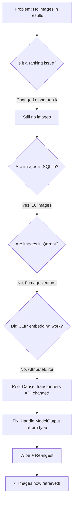

# Debugging Walkthrough: Why Images Were Not Being Retrieved

## The Problem

When running `python query.py "clinical management flowchart"`, the system returned only TABLE and TEXT results — no images. The flowchart on page 8 of the PDF existed, but was invisible to the search engine.

---

## Phase 1: Initial Hypothesis — Ranking Bias

### Why this approach?
The retrieval pipeline returns text hits AND image hits, then merges them with a weighted score. If the weight favors text, images get pushed below the `top-k` cutoff and never appear.

### What I checked
I read [query.py](file:///d:/Cazelabs/Agents/doc-ai/query.py), [src/retrieval/pipeline.py](file:///d:/Cazelabs/Agents/doc-ai/src/retrieval/pipeline.py), and [config/settings.py](file:///d:/Cazelabs/Agents/doc-ai/config/settings.py):

```python
# config/settings.py (BEFORE)
hybrid_alpha: float = 0.6   # favored text over images

# src/retrieval/pipeline.py — how scores are weighted
for hit in text_hits:
    add_hit(hit, hit["score"] * settings.hybrid_alpha)     # text score × 0.6
for hit in image_hits:
    add_hit(hit, hit["score"] * (1 - settings.hybrid_alpha)) # image score × 0.4
```

With `alpha=0.6`, a text hit scoring `0.48` becomes `0.288`, but an image hit scoring `0.48` becomes only `0.192`. Combined with `--top-k 5` (default), images were getting cut off.

### Fix applied
```diff
# config/settings.py
- hybrid_alpha: float = 0.6
+ hybrid_alpha: float = 0.5   # equal weight for text and image

# query.py
- parser.add_argument("--top-k", type=int, default=5, ...)
+ parser.add_argument("--top-k", type=int, default=10, ...)
```

### Result: Still no images. The problem was deeper.

---

## Phase 2: Verifying Assets in the Database

### Why this approach?
Before debugging the search, I needed to confirm: **are images even being stored?** If the ingestion pipeline silently failed to extract or embed images, no amount of ranking changes would help.

### Script: [verify_assets.py](file:///d:/Cazelabs/Agents/doc-ai/verify_assets.py)
```python
import sqlite3

conn = sqlite3.connect("data/macpro.db")
cursor = conn.cursor()

# Count assets by type
cursor.execute("SELECT asset_type, COUNT(*) FROM asset GROUP BY asset_type")
for row in cursor.fetchall():
    print(f"  - {row[0]}: {row[1]}")
```

### Result
```
Assets by type in SQL:
  - IMAGE: 10     ← Images exist in SQLite metadata!
  - OCR: 6
  - TABLE: 42
  - TEXT: 18
```

**10 images were extracted from the PDFs and recorded in SQLite.** So the PDF parser was working fine. The problem had to be in the vector store.

---

## Phase 3: Checking the Vector Store (Qdrant)

### Why this approach?
SQLite stores metadata (what was extracted), but Qdrant stores the actual vectors that power similarity search. If Qdrant doesn't have the image vectors, the search engine can't find them.

### Script: [check_all_types.py](file:///d:/Cazelabs/Agents/doc-ai/check_all_types.py)
```python
from qdrant_client import QdrantClient

client = QdrantClient(path="data/qdrant")

# Scroll through ALL points and collect unique asset_type values
offset = None
all_types = set()
total_count = 0

while True:
    res = client.scroll(collection_name="macpro_medical", limit=100, offset=offset)
    points, offset = res
    for p in points:
        all_types.add(p.payload.get('asset_type'))
        total_count += 1
    if offset is None:
        break

print(f"Total points: {total_count}")
print(f"Unique asset types: {all_types}")
```

### Result
```
Total points: 117
Unique asset types: {'text', 'ocr', 'table'}   ← NO 'image'!
```

> [!CAUTION]
> **This was the smoking gun.** SQLite had 10 images, but Qdrant had ZERO image vectors. The data was out of sync. The CLIP embedding step must have failed silently during ingestion.

---

## Phase 4: Diagnosing the CLIP Embedding Failure

### Why this approach?
The ingestion pipeline calls `self.image_embedder.embed_image_bytes()` which uses CLIP to generate a 512-dim vector. If this returns `None`, the `if img_vec:` guard in the pipeline silently skips the Qdrant insert. I needed to test if CLIP itself was broken.

### Script: [test_clip_load.py](file:///d:/Cazelabs/Agents/doc-ai/test_clip_load.py)
```python
from transformers import CLIPProcessor, CLIPModel
from PIL import Image
import torch

model = CLIPModel.from_pretrained("openai/clip-vit-base-patch32")
processor = CLIPProcessor.from_pretrained("openai/clip-vit-base-patch32")

img = Image.new('RGB', (224, 224), color=(73, 109, 137))
inputs = processor(images=img, return_tensors="pt")

with torch.no_grad():
    feats = model.get_image_features(**inputs)
    print(f"Shape: {feats.shape}")  # ← This line CRASHED
```

### Result
```
AttributeError: 'BaseModelOutputWithPooling' object has no attribute 'shape'
```

**The return type of `model.get_image_features()` had changed!** In older versions of `transformers`, it returned a raw `torch.Tensor`. In newer versions, it returns a `BaseModelOutputWithPooling` object (a dict-like wrapper).

### Script: [test_clip_type.py](file:///d:/Cazelabs/Agents/doc-ai/test_clip_type.py)
```python
# Confirmed: the return type is NOT a tensor
outputs = model.get_image_features(**inputs)
print(f"Return type: {type(outputs)}")  
# → <class 'transformers.modeling_outputs.BaseModelOutputWithPooling'>
```

---

## Phase 5: The Fix

### Why this fix?
The [embed_text_for_image_search](file:///d:/Cazelabs/Agents/doc-ai/src/embeddings/models.py#116-144) method in the same file already had robust handling for this exact issue (checking `isinstance` and falling back to attribute access). The [embed_image_bytes](file:///d:/Cazelabs/Agents/doc-ai/src/embeddings/models.py#88-110) method was missing this logic.

### The buggy code in [src/embeddings/models.py](file:///d:/Cazelabs/Agents/doc-ai/src/embeddings/models.py):
```python
# BEFORE — assumed get_image_features returns a tensor
def embed_image_bytes(self, image_bytes):
    ...
    with torch.no_grad():
        feats = model.get_image_features(**inputs)
        feats = feats / feats.norm(dim=-1, keepdim=True)  # ← CRASH here
    return feats[0].tolist()
```

### The fixed code:
```python
# AFTER — handles both tensor and ModelOutput return types
def embed_image_bytes(self, image_bytes):
    ...
    with torch.no_grad():
        outputs = model.get_image_features(**inputs)
        # Newer transformers versions return ModelOutput, not tensor
        if not isinstance(outputs, torch.Tensor):
            feats = getattr(outputs, "image_embeds", None)
            if feats is None:
                feats = getattr(outputs, "pooler_output", outputs)
        else:
            feats = outputs
        feats = feats / feats.norm(dim=-1, keepdim=True)
    return feats[0].tolist()
```

### Verification: [test_clip_fix.py](file:///d:/Cazelabs/Agents/doc-ai/test_clip_fix.py)
```
Original return type: <class 'transformers.modeling_outputs.BaseModelOutputWithPooling'>
Resolved feats type: <class 'torch.Tensor'>
Shape: torch.Size([1, 512])
✓ Success! First vector sum: -0.3098
```

---

## Phase 6: Wipe and Re-Ingest

After fixing the code, the old data was corrupted (SQLite had images but Qdrant didn't). We wiped both and re-ingested:

```powershell
Remove-Item -Recurse -Force data\qdrant, data\macpro.db, data\output\assets
.\venv\Scripts\python.exe ingest.py --folder data/input
```

### Final verification:
```
Total points: 38
Unique asset types: {'text', 'ocr', 'table', 'image'}   ← IMAGE is now present!
```

### Query result:
```
[1] TABLE  | Ch-020-STG-Acute-Watery-Diarrhea (1).pdf | score=0.239
[2] TABLE  | Ch-020-STG-Acute-Watery-Diarrhea (1).pdf | score=0.237
[3] TABLE  | Ch-020-STG-Acute-Watery-Diarrhea (1).pdf | score=0.198
[4] OCR    | Ch-020-STG-Acute-Watery-Diarrhea (1).pdf | score=0.188
    path: data\output\assets\...\p8_img0.png
[5] IMAGE ★ | Ch-020-STG-Acute-Watery-Diarrhea (1).pdf | score=0.188  ← FLOWCHART!
    path: data\output\assets\...\p8_img0.png
[6] IMAGE ★ | Ch-020-STG-Acute-Watery-Diarrhea (1).pdf | score=0.112
[7] IMAGE ★ | Ch-020-STG-Acute-Watery-Diarrhea (1).pdf | score=0.112
```

---

## Summary of All Changes Made

| File | Change | Why |
|---|---|---|
| [models.py](file:///d:/Cazelabs/Agents/doc-ai/src/embeddings/models.py) | Added `ModelOutput` → `Tensor` extraction in [embed_image_bytes](file:///d:/Cazelabs/Agents/doc-ai/src/embeddings/models.py#88-110) | **Root cause fix** — CLIP embedding was silently failing |
| [settings.py](file:///d:/Cazelabs/Agents/doc-ai/config/settings.py) | Changed `hybrid_alpha` from `0.6` to `0.5` | Equal weight for text and image search results |
| [query.py](file:///d:/Cazelabs/Agents/doc-ai/query.py) | Increased default `top-k` from 5→10, added `try/except` for LLM errors, added ★ marker for images | Better visibility of image results, graceful LLM failure |

## Key Learning: The Debugging Methodology



> [!TIP]
> **Always check data at each layer independently.** Don't assume that because data exists in one store (SQLite), it exists in another (Qdrant). Silent failures in ML pipelines are extremely common because methods return `None` instead of raising exceptions.
